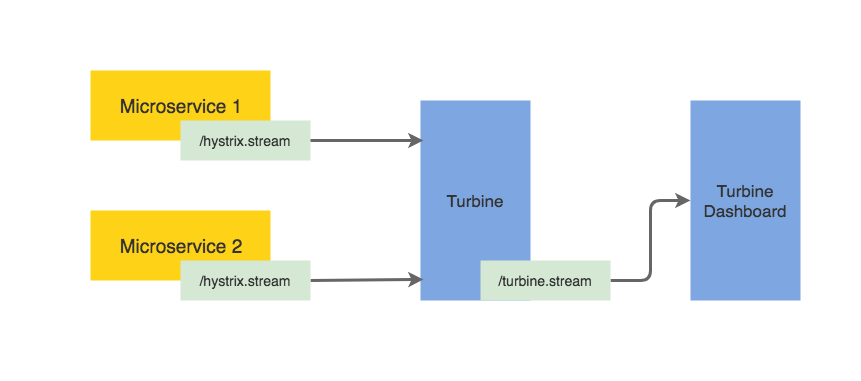
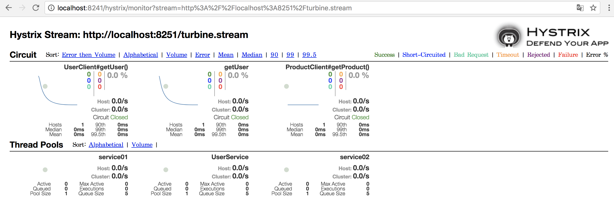

# Hystrix monitor
> Spring Cloud Hystrix + Turbine + Dashboard

각 서비스별 Hystrix Stream 을 통합하여 대시보드에 표시해준다.

## Getting started

- System Requirements

| Type      	| Tool         	| Version      	|
|-----------	|--------------	|--------------	|
| Compiler  	| JDK         	| 1.8 이상     	|
| Builder   	| maven        	| 3.2 이상     	|
| Framework 	| Spring Boot  	| 2.0.2       	|
|           	| Spring Cloud 	| Finchley.RELEASE 	|

- Screenshot

## Related Links

- [MSA CoE Guide](https://coe.gitbook.io/guide/circuit-breaker/hystrix#4-hystrix-turbine)

- [Official site](https://github.com/Netflix/Turbine/wiki)

